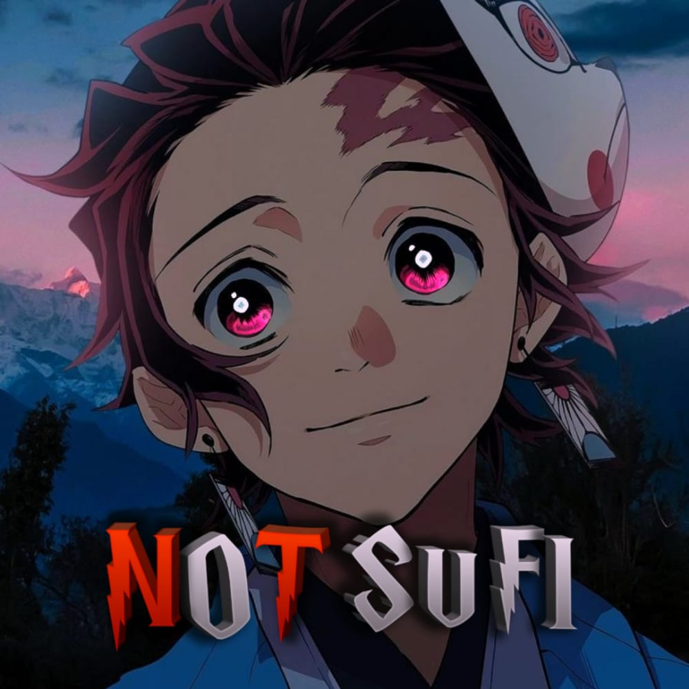

[](https://git.io/typing-svg)
<div align="center">
        
</p>

<a href="#"></a>
</p>
  <p align="center">
</p>
</div>
<p align="center">
Project created by <a href="https://github.com/its-me-ansif-sufi">Sufi-Ansif</a> to make it public
    <br>
       | © |
        Reserved |
    <br> 
</p>


## Setup
<div align="center">

  ### Simple Method
 
[](https://replit.com/@its-me-ansif-sufi/Not-Sufi?v=1)
  

[](https://heroku.com/deploy?template=https://github.com/its-me-ansif-sufi/Not-Sufi) 
        
<a href="https://github.com/its-me-ansif-sufi/Not-Sufi/fork"></a>
<br>
        
1. Click [SCAN](https://replit.com/@its-me-ansif-sufi/Not-Sufi?v=1) and scan QR through Whatsapp Linked Devices Option in Your whatsapp App.
2. You will get a long text that needs after 4th step (ALEXA_QR_CODE).
3. If You don't have a account in [Heroku](https://signup.heroku.com/), Create a account.
4. Click [FORK](https://github.com/its-me-ansif-sufi/Not-Sufi/fork)
5. Click the url showing below to copy deploy template
```
https://heroku.com/deploy?template=https://github.com/its-me-ansif-sufi/Not-Sufi
``` 
6. Now change its-me-ansif-sufi with your github username and click ENJOY<br>
   <br>
# Contact for help:
   * Click [Contact](https://wa.me/916380260672?text=Need+Help🙂) Here For Contact Toxic-Turbo
 
### The Hard Method
```js
GET QR
$ apt install git
$ apt install nodejs --fix-missing
$ git clone https://github.com/its-me-ansif-sufi/Not-Sufi
$ cd Not-Sufi
$ npm install @adiwajshing/baileys
$ npm install chalk
$ node Not-Sufi.js
```
      
```js
SETUP
$ git clone https://github.com/its-me-ansif-sufi/Not-Sufi
$ cd Not-Sufi
$ npm i
$ node Not-Sufi.js
```

----

  <p align="center">
  <a href="https://github.com/its-me-ansif-sufi/Not-Sufi">
    
<a href="https://github.com/its-me-ansif-sufi/followers">

<p align="center">
<a href="https://github.com/its-me-ansif-sufi/Not-Sufi/followers"
</a>
<a href="https://github.com/its-me-ansif-sufi/Not-Sufi/stargazers/"></a>
<a href="https://github.com/its-me-ansif-sufi/Not-Sufi/network/members"></a>
</p>

## 📢 Guide
Click WA logo to Join Support Group 👇
    <br>
<br>
  [](https://chat.whatsapp.com/ItBIrnVUOX8AwTTNJn21Ih)
  <div align="center">


Click WA logo to Join public bot Group👇
    <br>
<br>
  [](https://chat.whatsapp.com/ItBIrnVUOX8AwTTNJn21Ih)
  <div align="center">

  </div>


### contact on instagram👇

[](https://www.instagram.com/_not_sufi_)


### ⚠️ Warning! 
```
Due to Userbot; Your WhatsApp account may be banned.
This is an open source project, you are responsible for everything you do. 
Absolutely, Asena executives do not accept responsibility.
By establishing the Asena, you are deemed to have accepted these responsibilities.
```
    
    


## License
This project is protected by `GNU General Public Licence v3.0` license.

### Disclaimer
`WhatsApp` name, its variations and the logo are registered trademarks of Facebook. We have nothing to do with the registered trademark
